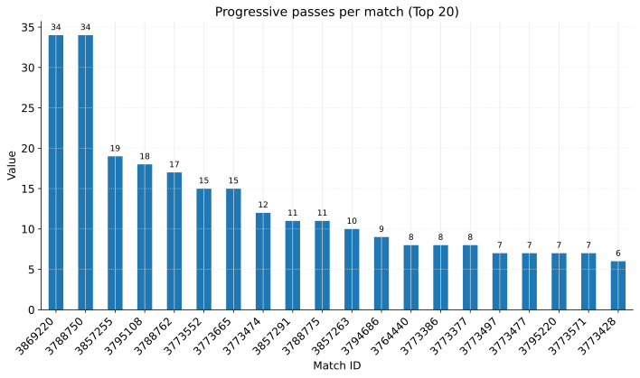
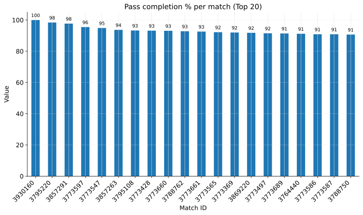
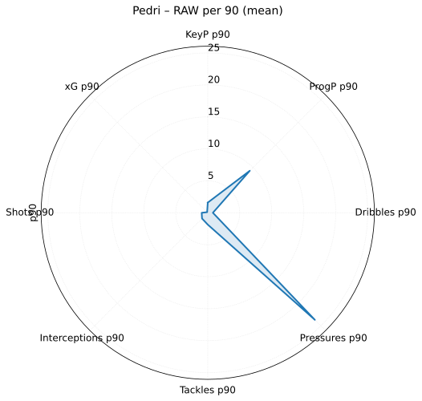
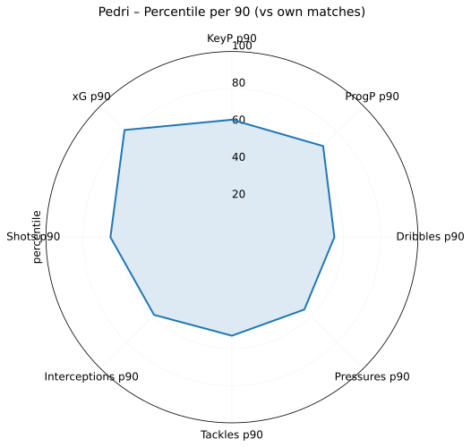
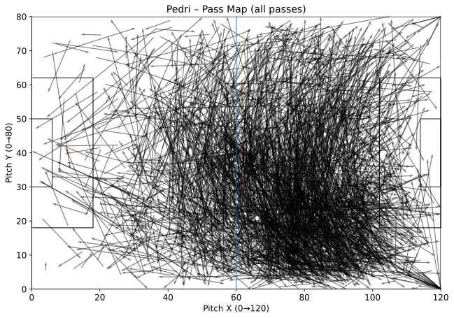
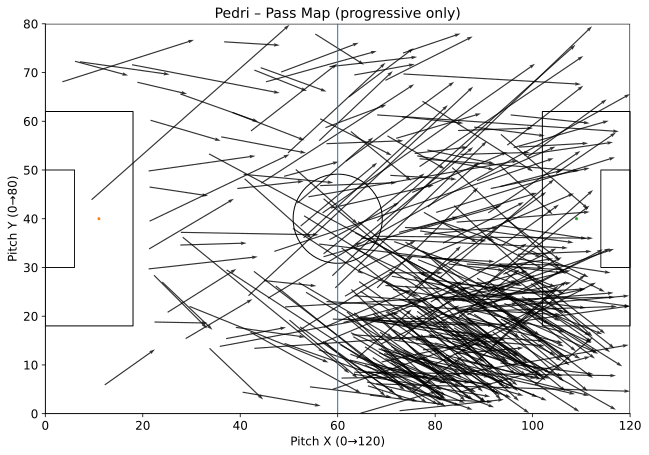

# pedri-analysis

Profil gry **Pedriego** na danych zdarzeń (StatsBomb-like).  
Skrypt liczy metryki per mecz i agregaty, a następnie generuje CSV + wizualizacje (bary, histogramy, **heatmapa**, **radary**, **pass mapy**).

---

## Najważniejsze cechy

- `match_id` **zawsze** z nazwy pliku (`data/events/*1234567*.json`) — koniec z `unknown`.
- Spójne artefakty w podkatalogach:
  - **CSV** → `outputs/csv/`
  - **Wykresy (PNG+SVG)** → `outputs/figures/`
- Wizualizacje:
  - Bary z etykietami (Top-20),
  - Histogramy per90,
  - Heatmapa zdarzeń na tle boiska,
  - **Radary**: RAW p90 + percentyle,
  - **Pass map**: wszystkie podania oraz tylko progressive.
- Orkiestracja: `automation/run_all.py` (preferuje `venv`, działa **wyłącznie** w bieżącym repo).

---

## Wymagania

- Python **3.10+** (działa także na 3.13)
- Pakiety: `pandas`, `numpy`, `matplotlib`

> Dane (`data/events/*.json`) **nie są** częścią repo – wgraj je lokalnie.

---

## Szybki start

### 1) Klon i środowisko
```powershell
git clone <URL repo>
cd pedri-analysis

python -m venv venv
.\venv\Scripts\Activate.ps1
pip install -U pip
pip install pandas numpy matplotlib
```

### 2) (Opcjonalnie) `.env`
Dla Pythona/VS Code:
```
PYTHONPATH=${workspaceFolder};${workspaceFolder}/core
```

### 3) Uruchomienie
Cała paczka:
```powershell
python automation/run_all.py
```
albo sam analizator (generuje CSV + wszystkie wykresy, w tym radary i pass mapy):
```powershell
python core/pedri_analysis.py
```

---

## Struktura repo (docelowo)

```
pedri-analysis/
├─ automation/run_all.py
├─ core/                 # kod .py
├─ data/events/*.json    # lokalnie, poza repo
├─ outputs/
│  ├─ csv/
│  └─ figures/
└─ README.md

```

---

## Wyniki (artefakty)

### CSV (`outputs/csv/`)
- `pedri_match_stats.csv` – rdzeń per-mecz
- `pedri_match_stats_extended.csv` – pełny per-mecz (w tym *_p90)
- `pedri_summary.csv` – agregat 1-wierszowy

> Alias zgodności: `pedri_per_match_stats.csv` — możesz wyłączyć z git (patrz `.gitignore`).

### Wizualizacje (`outputs/figures/`)
- **Bary**:
  - `pedri_key_passes_per_match.(png|svg)`
  - `pedri_prog_passes_per_match.(png|svg)`
  - `pedri_pass_pct_per_match.(png|svg)`
- **Histogramy per90**:
  - `pedri_pressures_p90_hist.(png|svg)`
  - `pedri_tackles_p90_hist.(png|svg)`
  - `pedri_interceptions_p90_hist.(png|svg)`
- **Heatmapa**:
  - `pedri_event_heatmap_hexbin.(png|svg)`
- **Radary**:
  - `pedri_radar_p90_raw.(png|svg)`
  - `pedri_radar_p90_percentile.(png|svg)`
- **Pass maps**:
  - `pedri_pass_map_all.(png|svg)`
  - `pedri_pass_map_progressive.(png|svg)`

### Podgląd w README (SVG wyglądają ostro na GitHubie)
```md
## Kluczowe wykresy




## Radar (per 90)



## Pass maps


```

---

## Jak to działa (skrót)

- Skan `data/events/**/*.json`, filtr eventów Pedriego (`player.id=30486`),
- Liczenie per-mecz (podania, key passes, progressive, dryblingi, pressing, obrona, strzały, xG),
- Szacowanie minut z eventów (substytucje / zakres czasów),
- Metryki *_p90,
- Eksport CSV (do `outputs/csv/`) i wizualizacje (do `outputs/figures/`),
- Heatmapa na boisku 120x80 (skala StatsBomb-like),
- Radary: RAW p90 (średnie) oraz percentyle względem rozkładu meczów Pedriego,
- Pass map: strzałki start→koniec; osobno **progressive**.

---

## VS Code (opcjonalnie)

`.vscode/settings.json` — polecane:
```json
{
  "files.autoSave": "afterDelay",
  "files.autoSaveDelay": 1500,
  "editor.formatOnSave": true,
  "files.trimTrailingWhitespace": true,
  "python.analysis.extraPaths": [
    "${workspaceFolder}",
    "${workspaceFolder}/core"
  ],
  "python.envFile": "${workspaceFolder}/.env"
}
```

---

## Git: co commitować?

**Tak:**
- `core/pedri_analysis.py`, `automation/run_all.py`, ustawienia (`.vscode/`, `.env` jeśli chcesz),
- `outputs/csv/*.csv`,
- `outputs/figures/*.png`, `outputs/figures/*.svg`.

**Nie (opcjonalnie):**
- `outputs/csv/pedri_per_match_stats.csv` (alias).
  Dodaj do `.gitignore`:
  ```gitignore
  outputs/csv/pedri_per_match_stats.csv
  ```

---

## FAQ / Troubleshooting

- **Matplotlib: `tick_params(..., ha=...)` błąd.**  
  Użyj obrót w `tick_params(labelrotation=45)`, wyrównanie przez `for lab in ax.get_xticklabels(): lab.set_ha("right")` (już zaimplementowane).

- **Uruchamia się z innej ścieżki (literówka w nazwie katalogu).**  
  `automation/run_all.py` jest „strict” – odpala **tylko** skrypty z `<ROOT>/core` lub `<ROOT>`. Używaj tej wersji orkiestratora.

- **Brak danych.**  
  Upewnij się, że masz JSON-y w `data/events/` (i ew. podkatalogach). Nazwy powinny zawierać numery `match_id`.

---


## What I learned

- ETL zdarzeń → spójne ramki danych

- Idempotentny pipeline (powtarzalne CSV + wykresy)

- Jakość: Black, flake8, PyTest (smoke), GitHub Actions

- Traceability: match_id z nazwy pliku + source_file

## Licencja / Dane

Projekt zakłada pliki events w formacie zgodnym ze StatsBomb-like.  
Sprawdź licencję i warunki wykorzystania danych, z których korzystasz, zanim udostępnisz repo publicznie.


 
