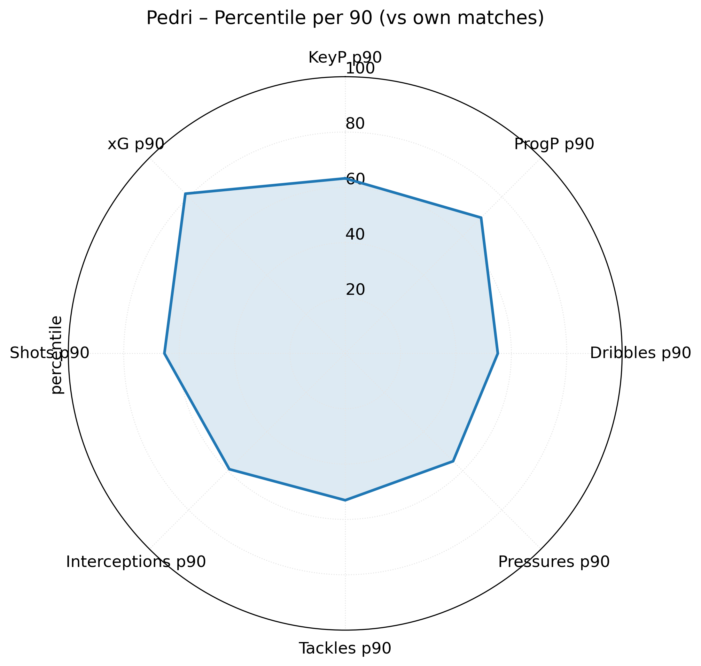
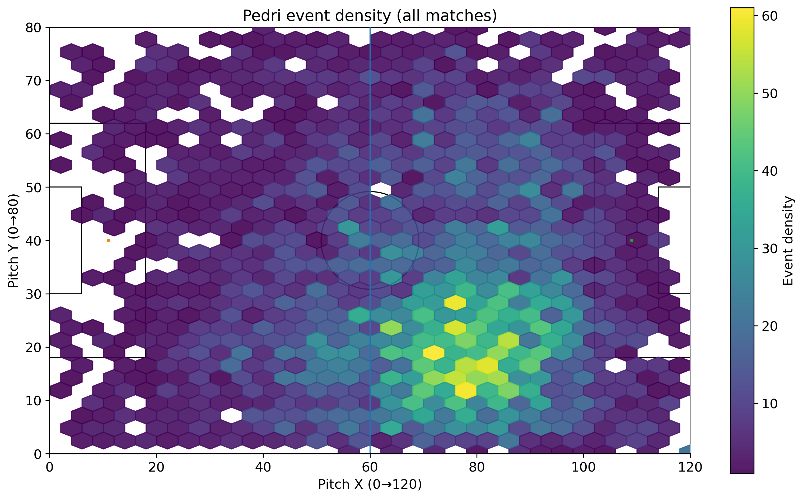

# pedri-analysis

[](https://github.com/Coltrane35/pedri-analysis/actions/workflows/lint.yml)


Analiza profilu gry **Pedriego** na danych zdarzeń w formacie StatsBomb-like. Projekt skanuje mecze, buduje statystyki per mecz i per 90 minut, a następnie generuje CSV oraz wizualizacje: heatmapy, radary i mapy podań.

<p align="center">
  
  
</p>

## Najważniejsze cechy

- analiza eventów Pedriego (`player.id = 30486`),
- `match_id` wyznaczany z nazwy pliku źródłowego,
- statystyki per mecz i metryki `*_p90`,
- progressive passes, key passes, dryblingi, pressing, odbiory, przechwyty, strzały i xG,
- heatmapa zdarzeń na boisku 120 × 80,
- radar wartości surowych i radar percentylowy,
- mapy wszystkich podań oraz podań progresywnych,
- powtarzalny pipeline uruchamiany przez `automation/run_all.py`,
- kontrola jakości kodu: Black, flake8, pytest i GitHub Actions.

## Wymagania

- Python 3.10+; CI używa Python 3.11,
- zależności runtime znajdują się w `requirements.txt`.

Dane meczowe nie są częścią repozytorium. Umieść własne pliki JSON lokalnie w `data/events/`.

## Szybki start

```powershell
git clone https://github.com/Coltrane35/pedri-analysis.git
cd pedri-analysis

python -m venv venv
.\venv\Scripts\Activate.ps1
python -m pip install --upgrade pip
pip install -r requirements.txt

python automation/run_all.py
```

Możesz też uruchomić sam główny analizator:

```powershell
python core/pedri_analysis.py
```

## Struktura repozytorium

```text
pedri-analysis/
├─ .github/workflows/     # GitHub Actions
├─ automation/            # orkiestracja pipeline
├─ core/                  # główna logika analizy
├─ utils/                 # pomocnicze funkcje i wizualizacje
├─ tests/                 # smoke tests
├─ docs/figures/          # przykładowe wykresy do README
├─ data/                  # dane lokalne, ignorowane przez Git
├─ outputs/               # generowane wyniki, ignorowane przez Git
├─ methodology.md         # metodologia projektu
├─ requirements.txt       # zależności runtime
└─ requirements-ci.txt    # zależności CI
```

## Wyniki

Pipeline generuje między innymi:

### CSV

- `outputs/csv/pedri_match_stats.csv`
- `outputs/csv/pedri_match_stats_extended.csv`
- `outputs/csv/pedri_summary.csv`

### Wizualizacje

- key passes per match,
- progressive passes per match,
- pass completion percentage,
- histogramy pressing/tackles/interceptions per 90,
- event heatmap,
- radar RAW p90,
- radar percentylowy,
- pass map wszystkich podań,
- pass map podań progresywnych.

## Jak działa pipeline

1. Skanuje `data/events/**/*.json`.
2. Filtruje zdarzenia Pedriego.
3. Buduje statystyki dla poszczególnych meczów.
4. Szacuje minuty gry na podstawie eventów i zmian.
5. Wylicza metryki per 90 minut.
6. Eksportuje CSV oraz generuje wykresy.

Szczegóły założeń analitycznych znajdują się w [`methodology.md`](methodology.md).

## Jakość i CI

GitHub Actions automatycznie uruchamia:

```text
flake8
black --check
pytest
```

Lokalnie możesz wykonać te same kontrole:

```powershell
pip install -r requirements-ci.txt
flake8 --config .flake8 core automation
black --check core automation
pytest -q tests
```

## Czego nauczyłem się w projekcie

- przetwarzania tysięcy zdarzeń JSON do spójnych danych tabelarycznych,
- budowania powtarzalnego pipeline ETL/analitycznego,
- tworzenia metryk i wizualizacji football analytics,
- zachowania traceability poprzez `match_id` i `source_file`,
- pracy z Git, pull requestami i GitHub Actions,
- stosowania Black, flake8 i prostych testów automatycznych.

## Dane i licencja

Kod projektu jest dostępny na licencji MIT. Dane StatsBomb-like należy pozyskać i wykorzystywać zgodnie z warunkami ich źródła; nie są one dystrybuowane w tym repozytorium.
